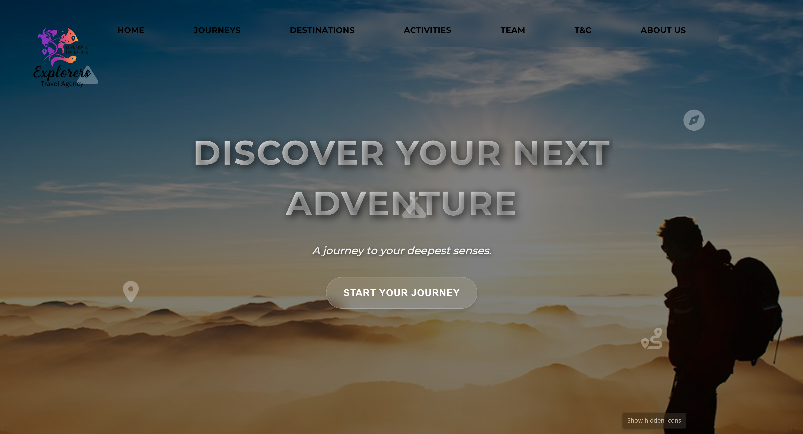
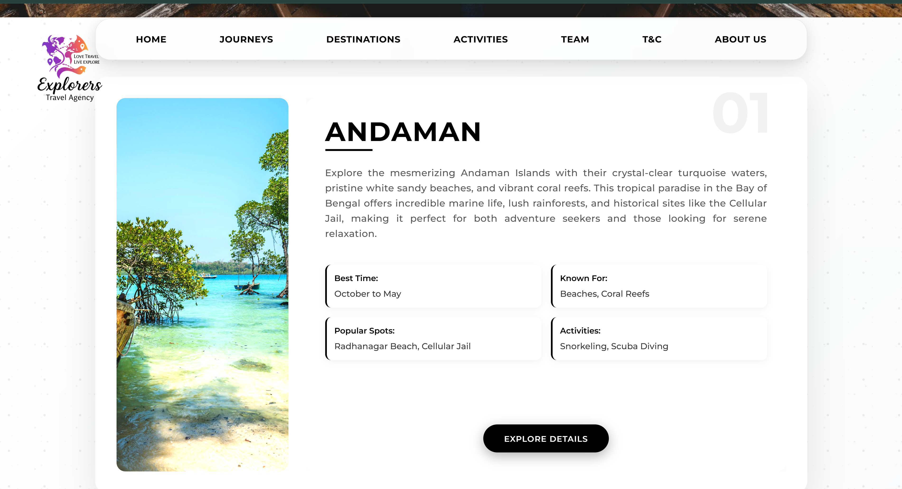
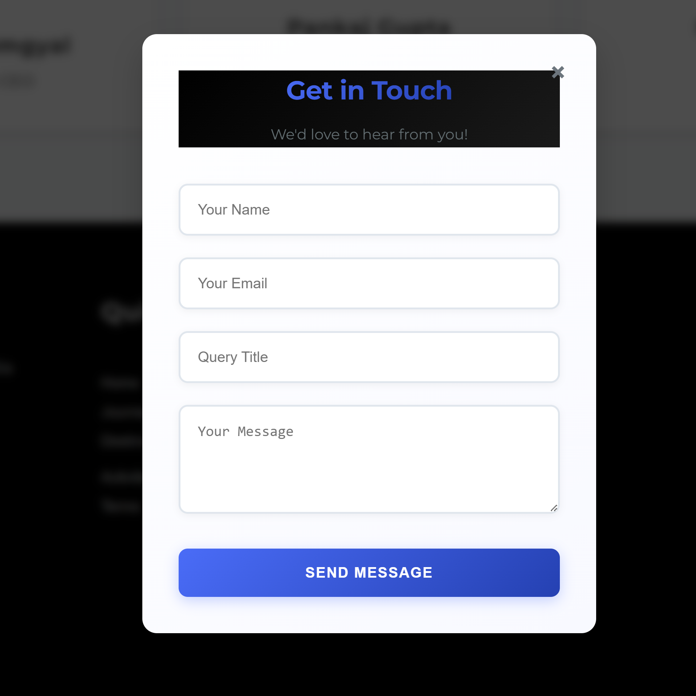

# 🌍 Explorers – Travel Agency Website (Frontend)

A beautifully designed, multi-page travel agency website built as a **college group project** and later refined into a polished, real-world production-ready site.

---

## 🚀 Project Overview

What began as a simple college assignment transformed into a live website for **Explorers – love travel live explore**. Built collaboratively by a team of **five frontend developers**, this project spanned about **one month** and includes:

- Desktop-optimized design (clean, responsive layouts for large screens)
- Seamless **EmailJS** integration for handling contact form queries via email
- Five distinct pages: **Home**, **Destinations**, **Activities**, **About The Company**, and **Terms & Conditions**
- Rich UI/UX elements, smooth navigation, and high visual fidelity
- Only frontend: built entirely with HTML, CSS, JavaScript (no backend/database)

---

## 🌐 Live Demo

Explore the live site here:  
👉 https://explorers.net.in

---

## 🧰 Built With

- **HTML5** & **CSS3** (semantic markup, Flexbox/Grid layouts)  
- **JavaScript**  
- **EmailJS** for email integration with the contact form  

---

## 🎯 Key Features

- 🏠 **Multi-Page Structure**  
  - **Home**:
    The Home Page comprises of hero banner, different journeys into ladakh that the company already offers and Meet the Team section. Each journey opens a new webpage where the itinerary is explained in detail.
    
  - **Destinations**:
    This covers the various destinations other than Ladakh that are offered by the Company. Each Destination is explained in very brief including best time to visit, what it is known for and activities the place offers.
    
  - **Activities**:
    This page comprises of various adventure activities that are offered by the company in Ladakh. The Trek card comprises of 4 treks which lead to a separate webpage of their own.
    
  - **About The Company**:
    This webpage includes information like introduction of the company, why to choose them and past organisations that have collaborated with them.
    
  - **Contact**:
    As the website is only front-end, a feature of EmailJS has been added so that if anyone wants to contact the team, they can leave an email which will be received by an official via EmailJS
The viewer can also contact through Whatsapp. Both these options are present at footer on every single webpage


- 📧 **EmailJS Integration**  
  Visitors can submit queries through the form, and emails are sent directly to the Explorers team inbox.

- 🖥️ **Desktop-First Design**  
  While optimized for desktop, this experience laid the foundation for future mobile responsiveness improvements.

- 🎨 **Consistent UI/UX**  
  Cohesive visuals, clear typography, and intuitive user flow.

---

## 🛠️ Getting Started

1. **Clone the repository**  
   ```bash
   git clone https://parth-2905.github.io/Explorers-Website/destinations.html
   cd Explorers-Website
   
**2. Run the website locally**
Since this is a frontend-only project, there's no build process required. Simply open index.html in your browser:

bash
Copy
Edit

**For most systems**
open index.html
**Or right-click and open it manually from your file explorer**


**3. (Optional) Configure EmailJS for Contact Form**
If you want to test the email functionality:

Sign up at emailjs.com
Create a service and template
Add your Service ID, Template ID, and Public Key to the contact.js file

## 👥 Team Credits

This project was a collaborative effort by a team of five dedicated frontend developers:

- Parth Gupta  
- Aarush Singh  
- Ishan Maurya
- Siddh Sigatia  
- Debanik Saha

Each member contributed to planning, layout design, UI development, and feature integration. Special thanks to **Explorers – love travel live explore** for entrusting us with the opportunity and supporting our learning journey.

---

## 📸 Screenshots

Here are a few glimpses of the final website:


  
*Home Page – Engaging hero section and introduction*

  
*Destinations – Featured travel spots in vibrant layout*

  
*Packages – Curated travel options with details*

  
*Itinerary of trek along with necessary details*

  
*Contact – EmailJS integrated contact form*


## Future Improvements

- Add mobile responsiveness  
  Enhance layout and design to adapt seamlessly to tablets and mobile devices for a better user experience on all screen sizes.

- Implement form validation and user-friendly error handling  
  Improve form UX with client-side validation, real-time feedback, and clear error messages.

- Add internationalization/localization support  
  Introduce multi-language support to make the site accessible to users from different regions.

- Integrate with a backend API  
  Connect to a backend service to dynamically fetch and manage travel package data instead of using static content.


   
